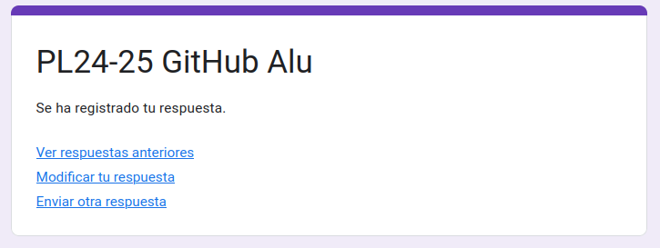
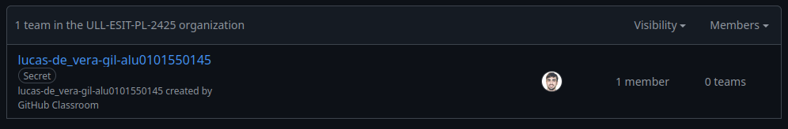

# Github Campus Expert 

- Nombre: Lucas
- Apellidos: de Vera Gil
- aluXXXX: alu0101550145
**Repositorio:** [GitHub Repo]([https://github.com/tu-repo](https://github.com/ULL-ESIT-PL-2425/github-campus-expert-lucas-de_vera-gil-alu0101550145))

## Introducción  
Esta práctica tiene como objetivo mejorar nuestras competencias en GitHub y establecer un flujo de trabajo adecuado. Se realizan tareas como la creación de un repositorio, configuración de un Project Board y la solicitud del Student Developer Pack.

## Creación del Equipo en GitHub Classroom  
Para aceptar la asignación, seguí los siguientes pasos:  
1. Accedí al enlace de GitHub Classroom.  
2. Creé un equipo con el nombre `nombre-apellido1-apellido2-aluXXXX` siguiendo las instrucciones.  
3. Confirmé la creación del equipo y accedí al repositorio generado automáticamente.  

## Cuestionario GitHub-Alu  
El cuestionario GitHub-Alu fue completado exitosamente como parte de la práctica.  

## Crear equipo con nombre correcto

## Crear un project board kanban para este repositorio

## Solicitud del Student Developer Pack  
Solicité el **Student Developer Pack** de GitHub, que incluye:  
- Repositorios privados ilimitados.  
- Créditos en plataformas como DigitalOcean y Heroku.  
- Acceso a herramientas premium como GitHub Copilot.  

## Entrega del `.zip` en Moodle  
El repositorio ha sido descargado en formato `.zip` y subido a la plataforma Moodle como parte de la entrega.  
